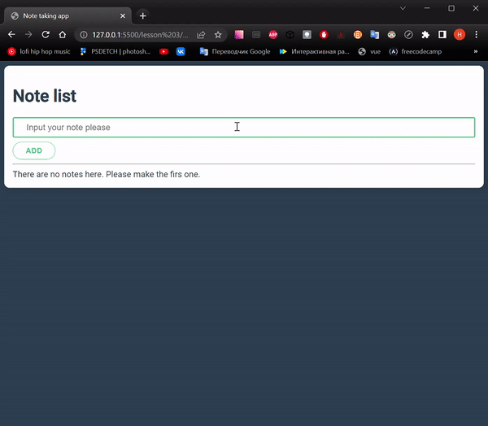
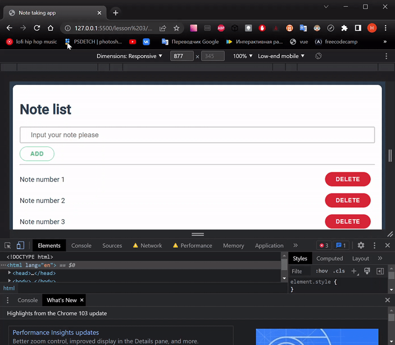

# Lesson 3

***[<< Back Lesson 2](https://github.com/syrovezhko/learning-vue/tree/lesson2/lesson%202)***

## A note taking app `v2`

We may make it better, I think. The optimizations of code, local storage etc.



> Test on the GitHab Pages: [click](https://syrovezhko.github.io/learning-vue/lesson%203/src/)
***

We will continue to work with the previous lesson code. You may copy it from [here](https://github.com/syrovezhko/learning-vue/tree/37dc6dbddb4f6237246fd60517ac7a2d71e88efa/lesson%202/src).

### Step 1: code minimize by Labels

You will notice that there are two most commonly used vue directives: `v-bind` and `v-on`.  
Usually developers used that's short labels: `:` Instead of `v-bind` and `@` Instead of `v-on`.  
Fore example: `v-bind:value="inputValue"` is equal to `:value="inputValue"`, `v-on:input="inputHandler"` is equal to `@input="inputHandler"`.

Now, you may minimize the code like this. Just do it!


### Step 2: introduction to forms optimization, `v-model`

We did a lot an extra work, you know? We wrote manually the `inputValue` bind throw the `inputHandler` model to provide [Two-Way Data Binding](https://github.com/syrovezhko/learning-vue/tree/lesson2/lesson%202#step-2-two-way-data-binding). Don't start lobbing rotten tomatoes at me. It was necessary to understanding the cornerstone of `v-model`.

Now, we may remove `inputHandler` from methods. Also, `v-bind:value="inputValue"` and `v-on:input="inputHandler"` should be replaced by `v-model` in the HTML, like this:
```HTML
<input
  class="form__input"
  type="text"
  @input="inputHandler"
  @keypress.enter="addNewNote"
  v-model="inputValue" <!-- 👈👈👈write this -->
  <!-- instead of this👇👇👇 -->
  <!-- :value="inputValue" -->
  <!-- @input="inputHandler" -->
>
```
You may see, the app works the same but 4 code strings shorter.

### Step 3: local storage

It's better to save the notes after refreshing page I guess. We will not used the API yet. The client side only.  
Client-side storage can be done with cookies, Local Storage (technically “Web Storage”), IndexedDB, and WebSQL (a deprecated method that should not be used in new projects). I we’ll focus on Local Storage, the simplest of the storage mechanisms.  
I've found  the official Vue2 [guide](https://v2.vuejs.org/v2/cookbook/client-side-storage.html). It should work Vue3 also, I hope so.  
We are interested in the [Working with Complex Values](https://v2.vuejs.org/v2/cookbook/client-side-storage.html#Working-with-Complex-Values) section.

Copy `mounted` hook to the `App` object. Pass `saveNote` method to the `methods` and call it in `addNewNote` and `removeNote` with `this` keyword.  
Attention! Do not forget to change all `cats` to `notes`😅

<details>
<summary>The app.js file look like this now:</summary>

```JS
const App = {
  data() {
    return {
      title: 'Note list',
      placeholderString: 'Input your note please',
      inputValue: '',
      notes: [],
    }
  },
  mounted() {
    if (localStorage.getItem('notes')) {
      try {
        this.notes = JSON.parse(localStorage.getItem('notes'));
      } catch(error) {
        localStorage.removeItem('notes');
      }
    }
  },
  methods: {
    addNewNote() {
      if (this.inputValue !== '') {
        this.notes.push(this.inputValue)
        this.inputValue = ''
        this.saveNote()
      }
    },
    removeNote(index) {
      this.notes.splice(index, 1)
      this.saveNote()
    },
    saveNote() {
      const parsed = JSON.stringify(this.notes);
      localStorage.setItem('notes', parsed);
    }
  }
}

Vue.createApp(App).mount('#app')
```
</details>
It's not so complicated. But the application become much more useful!  
But take a good look at the page after refresh. The content is twitching. I may see it clear using `low-end mobile mode`:



As written in the [documentation](https://vuejs.org/api/built-in-directives.html#v-cloak): 
> When using in-DOM templates, there can be a "flash of un-compiled templates": the user may see raw mustache tags until the mounted component replaces them with rendered content.

So, we need to do something...

### Step 4: un-compiled template hiding

`v-cloak` will help us to hide un-compiled template until it is ready. It's mean, we need to add the directive to container like this:

```HTML
<div class="container" id="app" v-cloak>
...
</div>
```

And to supplement CSS like this:

```CSS
[v-cloak] {
  display: none;
}
```

*Here we go! The page is refreshing smoothly.*

***

**It's enough for to today, I think.**  
You mau check out result of the work done here: [click](https://github.com/syrovezhko/learning-vue/tree/2846f7ba412e6409e779f0d92dcd3ad3e2bf0f47/lesson%203/src).

See you next lesson! Bye😀

**[Lesson 2](https://github.com/syrovezhko/learning-vue/tree/lesson2/lesson%202) | [Lesson 4](https://github.com/syrovezhko/learning-vue/tree/lesson4/lesson%204)**

[Back main branch](https://github.com/syrovezhko/learning-vue)